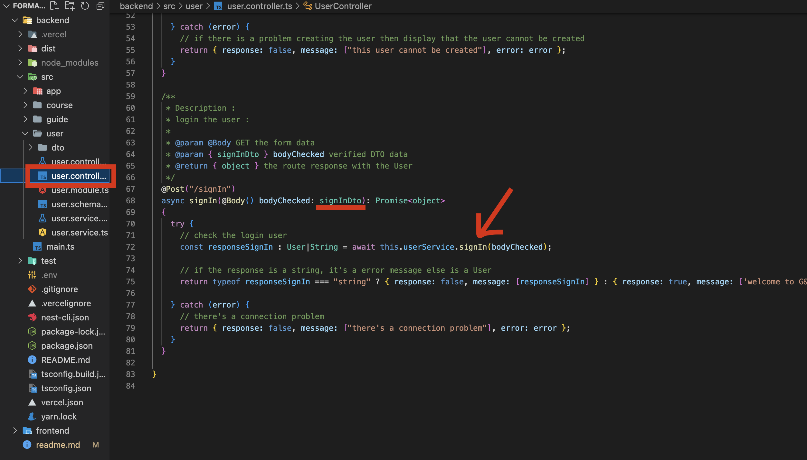
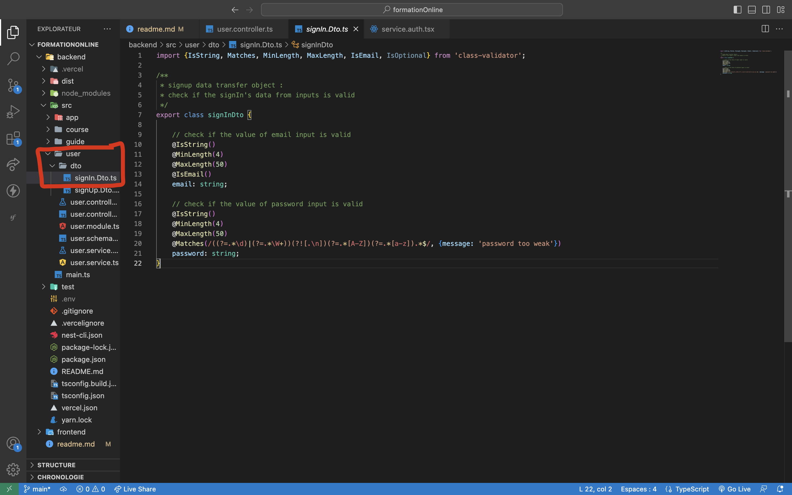
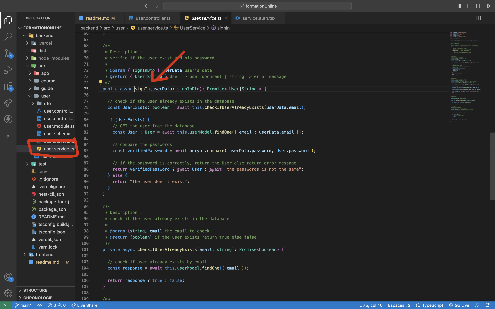
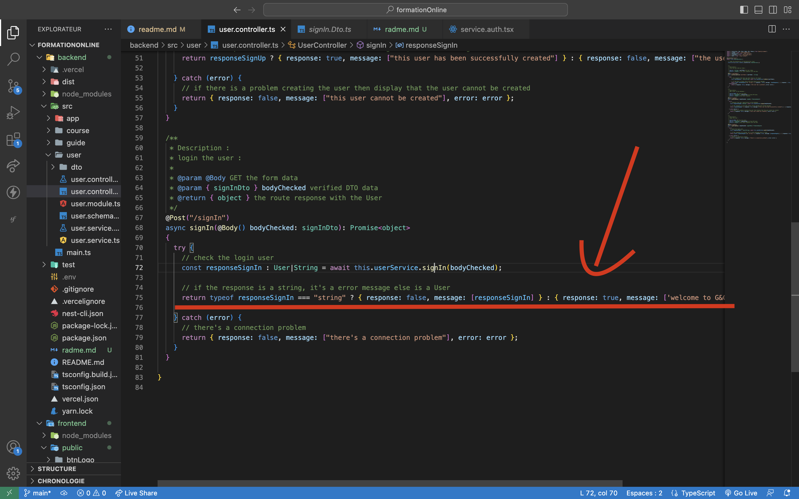

  

# Backend développement

Voila comment j'ai organisé chaque controller

- controler : manipulations des donnée 
- service : fonctions qui font des requetes en base de donnée
- Dto : verification des données récuperé

Voici un exemple :

1. J'utilise un route post qui récupère des données du body
ces données sont vérifié par le dto pour voir si elles sont valide
2. J'envoie ces données dans ma function qui excutera une requete en base de donnée
3. Je récupère la réponse de la function
4. je renvoie une réponse avec un message qui montre si la route fonctionnée ou échoué 

## 1/4 Controller

  

## 2/4 DTO (data transfere object)

  

## 3/4 Service fonction 

  

## 4/4 renvoie la réponse de la route 

  

J'ai utilisé chacune de mes routes de cette manière la.