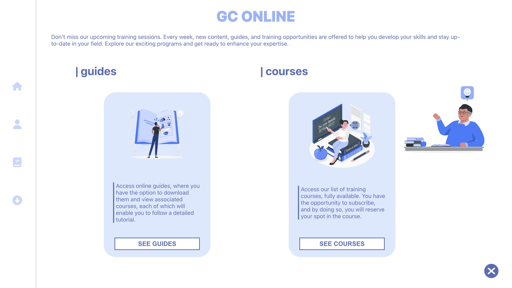

<div id="" align="center">
  
</div>

Lien de l'application: https://guide-course-frontend.vercel.app/

# Description :
Guides et Cours en ligne est une applications web qui permet de de visiter des guides (tuto) pour se reperer et par la suite vous avez la possibiltié de reserver des formations.

# Technologie utilisée

Frontend :
- React (framework)
- Typescript (langage)
- gsap (librairie)
- redux (librairie)

Backend :
- Node js (plateforme logicielle)
- Typescript (langage)
- Nest js (framework)

Database :
- MongoDB

# lancez l'applications en local 

***Prérequis docker cli***

Executez cette ligne de commande

```docker-compose up --build```

Dirigez vous vers ```http://localhost:8080```

# Infrastructure DevOps

Pour le déploiement et l'orchestration de notre application, nous avons mis en place une infrastructure DevOps qui inclut Docker et Railway.

## Utilisation de Docker

Pour faciliter le développement et le déploiement, nous avons configuré deux Dockerfiles :

- **Frontend Dockerfile** : Génère une image Docker contenant l'application React, facilitant ainsi son déploiement indépendant.
- **Backend Dockerfile** : Configure une image pour le backend Nest.js, avec toutes les dépendances nécessaires.

## Docker Compose

Pour exécuter l'application localement dans un environnement complet, nous utilisons un fichier `docker-compose.yml` qui :

- Lance les conteneurs **frontend** et **backend** pour qu'ils s'exécutent ensemble.
- Intègre **Prometheus** via une configuration `prometheus.yml` pour monitorer les services et suivre leur performance.

## Déploiement du Backend

Le backend, construit en tant qu’image Docker, est ensuite déployé sur **Railway**.
